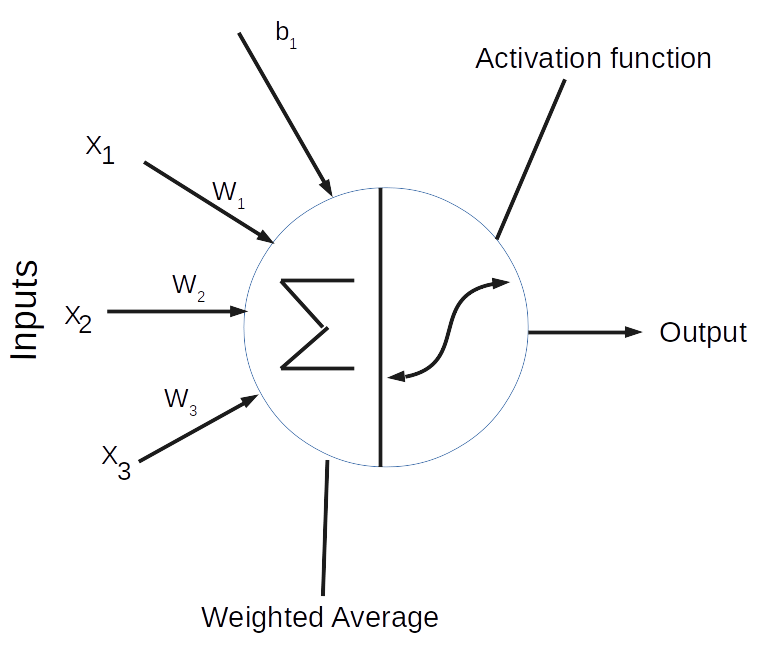
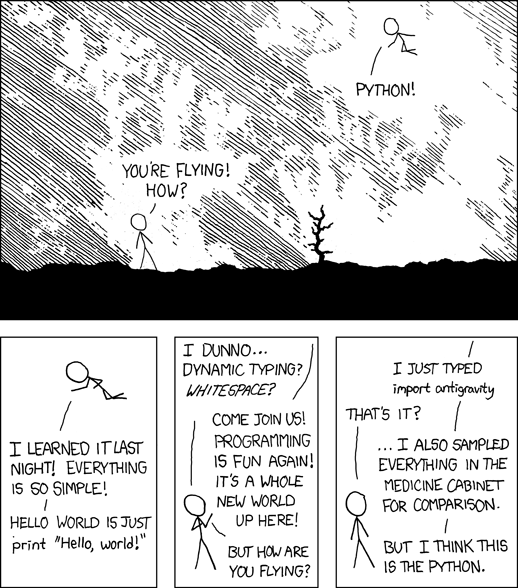

# Neural Networks from scratch only with NumPy

## What Is a Neural Network

_A neuron is a mathematical function that takes data as input, performs a transformation on them, and produces an output._

This means that neurons can represent any mathematical function; however, in neural networks, we typically use non-linear functions.

Building a nn from scratch helps in understanding how nn works in the back-end and it is essential for building effective models. Without delay lets dive into building our simple shallow nn model from scratch.

## Complete code is available here.

I would strongly recommend to start from p001 ([Basic-Neuron-3-inputs](https://github.com/raveendarv/neural-networks-numpy/p001-Basic-Neuron-3-inputs.py)) for better complete intuition, other files will be addes soon.

### Reference: 
   * [HSE](https://www.coursera.org/specializations/aml)
   * [Sentdex](https://www.youtube.com/watch?v=Wo5dMEP_BbI&list=PLQVvvaa0QuDcjD5BAw2DxE6OF2tius3V3&index=1 "Named link title")
   * [Heartbeat](https://heartbeat.fritz.ai/building-a-neural-network-from-scratch-using-python-part-1-6d399df8d432 "Named link title")
